# Bluemix Hands-on Lab for IoT: Creating a Taxi-Simulator

## Steps of the Lab
0. [Overview](#part0)
1. [Setup the needed application and services](#part1)
    1. [Setup and configure Node-RED](#part1-1)
    2. [Create and bind the needed Bluemix services](#part1-2)
2. [Configure the services and adapt the Node-RED flow](#part2)
    1. [Import existing Node-RED flow](#part2-1)
    2. [Configure Watson IoT inside the Node-RED "Configure-TaxiSimulation" Tab](#part2-2)
    3. [Configure the ObjectStorage Nodes inside the Node-RED "Configure-Blob for ObjectStorage" Tab and "Taxi-Simulation" Tab](#part2-3)
    4. [Configure the MessageHub Node inside the Node-RED "Configure-Blob for ObjectStorage" Tab](#part2-4)
3. [Use the Watson IoT input in Node-RED](#part3)
4. [Use the Web UI for Simulation](#part4)
5. [Analyze the IoT data with Data Science Experience](#part5)

---
## Overview <a name="part0"></a>

In this Lab you will create a **Taxi-Simulator** for IoT.
This Taxi-Simulator will create **sample data** for a Data Analytics part, in one of the following Labs of a Hands-on Workshop.

In the following image you can see the dependency of the two Labs.

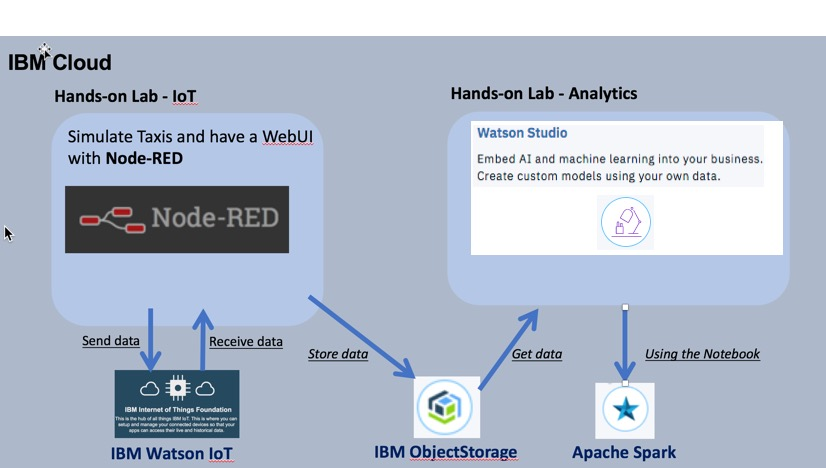

The objective of the first Lab is related to IoT, that means you will get a basic understanding of the IBM IoT and how to
customize your own flow in Node-RED, by using the given IoT Data to display in your Node-RED Dashboard UI.

**Here are the base UseCases of the UI**

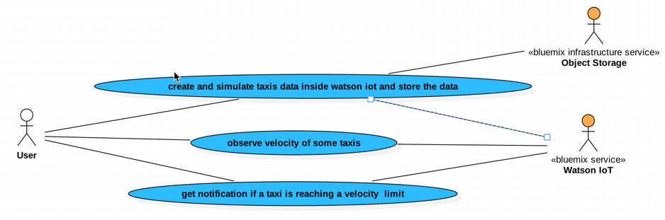

**Functionality of the existing Node-RED flow**

1. With the taxi-simulator you can create different Taxi devices inside the Watson IoT Platform.
2. You can choose the number of taxis you want to create.
3. A created taxi will simulate speed and geolocation and the created data will be stored in a database.
4. The flow contains a dashboard UI which provides the following functionality:

    - Create sample IoT devices
    - Observe the speeding of the Taxis
    - Start and stop simulation
    - Observe the first simulated taxi and if the speeding is too high get a notification. (This will be your task to implement.)

**The Lab contains the following steps**

*a) Setup:*
* A simulator for Taxis, sending their speed and location information.
* Setup the IBM Watson IoT

*b) Create your own Node-RED flow*
* Use Watson IoT as input in your flow
* Use the Node-RED for implementing some logic and UI

**What you will use in IBM Bluemix?**

* The **Node-RED Starter** _Boiler Template_ which contains a **Cloudant DB** and a **Node.JS Server**.
* You will add additional nodes into the Node-RED instance ([Node-RED Dashboard Node](https://flows.nodered.org/node/node-red-dashboard), [Node-RED Virtual IoT Device Node](https://www.npmjs.com/package/node-red-contrib-iot-virtual-device), [Node-RED Objectstore](http://flows.nodered.org/node/node-red-contrib-objectstore) and [Node-RED MessageHub](https://flows.nodered.org/node/node-red-contrib-messagehub))
* The [Watson IoT Service](https://console.bluemix.net/catalog/services/internet-of-things-platform?env_id=ibm%3Ayp%3Aus-south)
* The [Object Store Database](https://console.bluemix.net/catalog/services/Object-Storage?env_id=ibm%3Ayp%3Aus-south)
* The [Message Hub](https://console.bluemix.net/catalog/?context=services&app=bdd3e76c-09b7-47a6-8515-50c7e6b477e9&env_id=ibm%3Ayp%3Aeu-gb&search=Message%20Hub)


---
## 1. Setup the needed application and services <a name="part1"></a>

In this part of the Lab you will setup and configure the environment we will use for your **Taxi-Simulator**.

### 1.1 Setup and configure Node-RED <a name="part1-1"></a>

1. Logon to your Bluemix Account and search the catalog for Node-RED. You will find the **Node-RED Boiler Template** and click on the icon.

    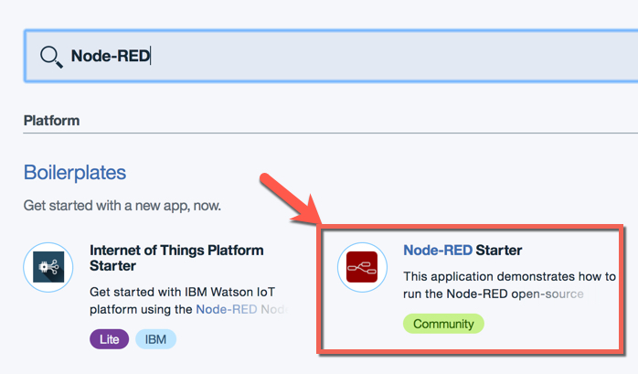

2. Now you can see which application and services will be created. Give the application and route a name like **taxi-simulator-[YOUR-UNIQUE-NAME]**. Here you can find the **Cloudant DB** and the **Node.JS Server** and press **create**.
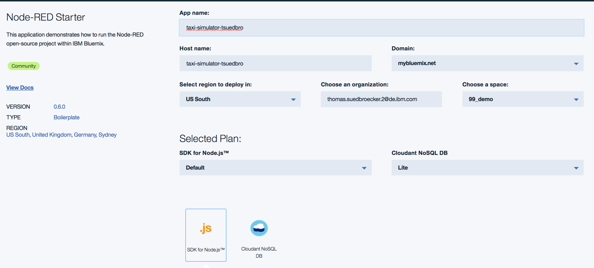

3. After this step, select **Visit App URL** to get to the Running Node-RED instance on the Node.JS Server. It might take a few minutes until the server is ready.

    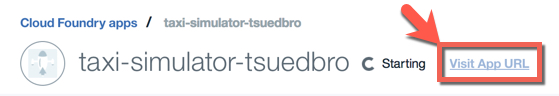

4. Now just **follow the steps in the wizard** to do the basic configuration of the Node-RED instance.
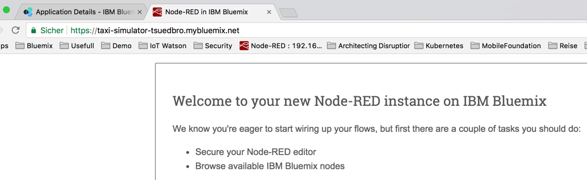

5. Now inspect the landing page and press **Go to your Node-RED flow editor**.
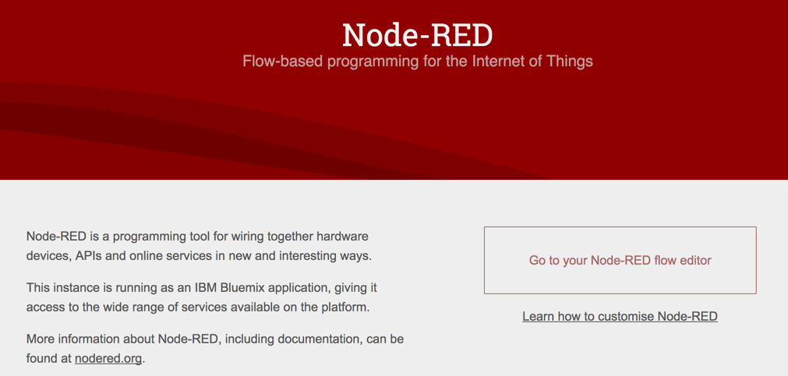

6. Inside Node-RED we have to add the additional _Nodes_ we will use in our future flow. (For example the [Node-RED Dashboard Package](https://flows.nodered.org/node/node-red-dashboard) and the [Node-RED Virtual IoT Device Package](https://www.npmjs.com/package/node-red-contrib-iot-virtual-device).) First select **manage palatte** from the menu on right upper side of the page.

    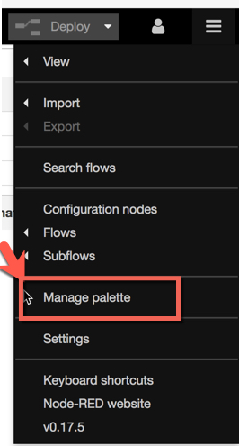

7. Now choose the Tab **install**, search and press install for each of these four nodes:
    * **node-red-dashboard**,
    * **node-red-contrib-iot-virtual-device**,
    * **node-red-contrib-objectstore**,
    * **node-red-contrib-messagehub**

    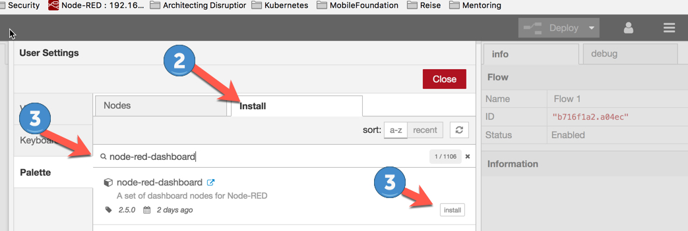

8. After the installation, verify that the following sections for the installed nodes will appear on the left hand side.
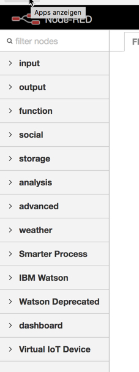

---
### 1.2 Create and bind the needed Bluemix services <a name="part1-2"></a>

**Watson IoT and MessageHub**

1. Go back to your bluemix application and select **connections** on the left hand side and press **connect new**.


2. Search for the Watson IoT Service by inserting **Internet of Things Platform** in the catalog search and press on the service.

    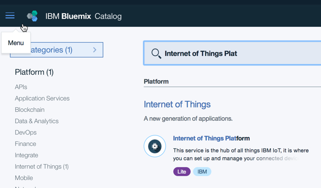

3. For the service name insert **taxi-simulator-InternetOfThingsPlatform** and press **create**. Do **NOT** select restage for now.
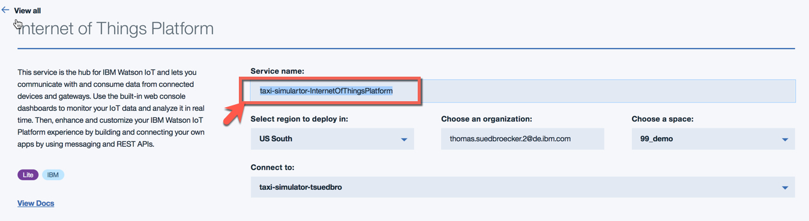

4. Repeat the steps 1 to 3 for the Service **MessageHub**. Name this service **taxi-simulator-MessageHub**.

---
**Cloud object storage**

1. Now open the Bluemix catalog directly.


2. Search for **Cloud Object Storage** directly in the catalog and in this infrastructure component, select **Object Storage OpenStack Swift for Bluemix**.
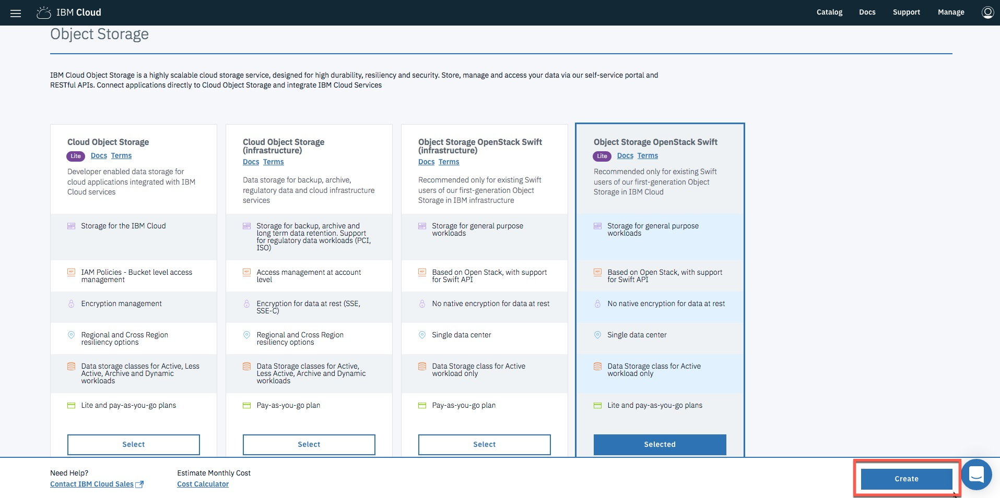

<!--- 2. Search for the **Cloud Object Storage** directly in the catalog and select in this infrastructure component the **Bluemix Storage Swift**. 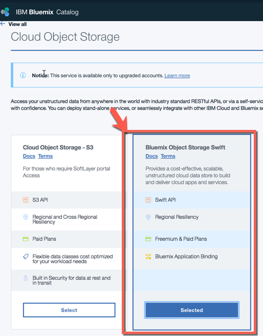-->

3. Name the service **taxi-simulator-ObjectStorage** and press create. _NOTE:_ You can only use **ONE** instance per **ORGANIZATION** of **Cloud Object Storage**.                       
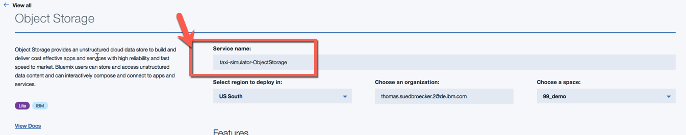

4. Open your Bluemix Application in the Bluemix Dashboard and select **connections**.

5. Then select **connect existing** and search for your just created **Cloud Object Storage for Bluemix** service. If you are now asked to restage the application, press **Restage**.

6. After these steps, you have connected services as in the following picture. In my case I have a different name for the **cloud object storage** service.                               
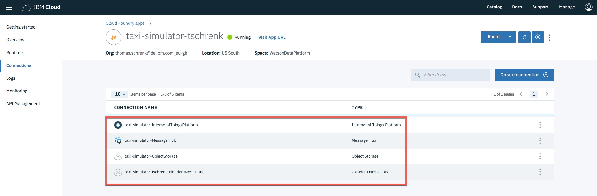

---
# 2. Configure the services and adapt the Node-RED flow <a name="part2"></a>

---
## 2.1 Import existing Node-RED flow <a name="part2-1"></a>

**Copy the prepared Node-RED flow into the your Node-RED instance**

1. Open the file **[Node-RED-Flows/Lab_start_20170928.json](Node-RED-Flows/Lab_start_20170928.json)** in GitHub and copy all the content into the clipboard.

2. Inside Node-RED, select **Menu->Import->Clipboard**
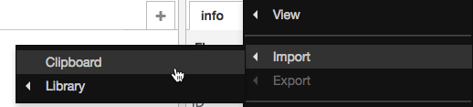

3. Take look into the three tabs
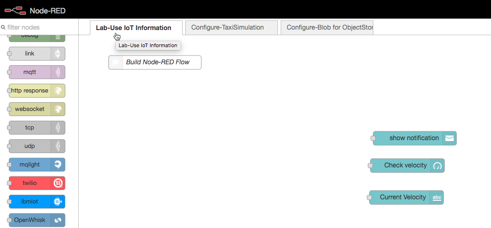

4. Press **Deploy** in the right upper corner of the Node-RED Editor page.

---
## 2.2 Configure Watson IoT inside the Node-RED "Configure-TaxiSimulation" Tab <a name="part2-2"></a>
Inside the **Configure-TaxiSimulation** tab you have following functionality:

1. With the taxi-simulator you can create different Taxi devices inside the Watson IoT Platform.
2. You can choose the number of taxis you want to create.
3. A created taxi will simulate speed and geolocation and the created data will be stored in a database.
4. The flow contains a dashboard UI.

---
## 2.2.1  Watson IoT Service and Node-RED configuration
Now you will create an app API-Key inside the Watson IoT Service and add the information to the existing Node-RED flow.

1. Open the existing Watson IoT Service and press launch
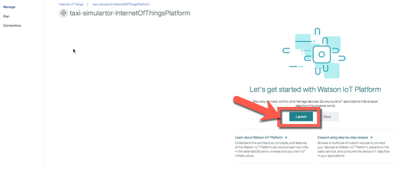

2. Create a new application API-Key inside Watson IoT by pressing **Generate API Key**
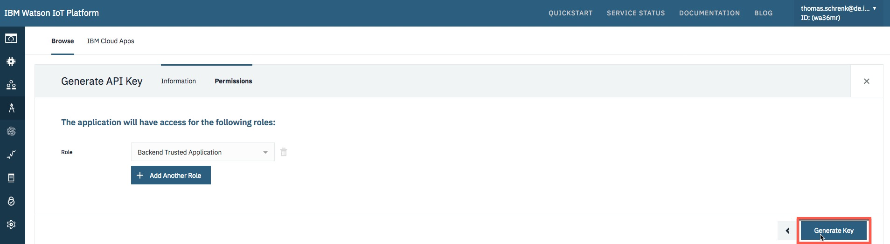

3. Change the API Role to **Backend Trusted Application** and insert **Taxi-Simulation** as a comment.
**NOTE: Don't close this window! Before pressing *generate*, please complete step 4.**
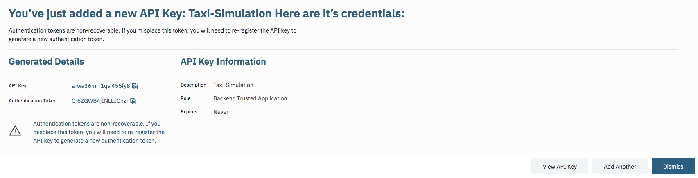

4. Now copy and paste API Key and Authentication Token into the Node-RED flow in the tab **Configure-TaxiSimulation**, by opening the function node **"set predefined config for Watson IoT"** and replacing the existing **API Key** and **Authentication Token** with your values. Use **API Key** for **Username** and **Authentication Token** for **Password**.
```
      flow.set("orgid", "XXXX");
      flow.set("instances","2");
      flow.set("username", "a-XXXX-twkonxv5oo");
      flow.set("password", "XX+0xANGIYdQG&SdXI");
      return msg
```

5. Also copy the Organization ID, which you can find in the right upper corner of the Watson IoT WebPage, into the **"set predefined config for Watson IoT"** node.
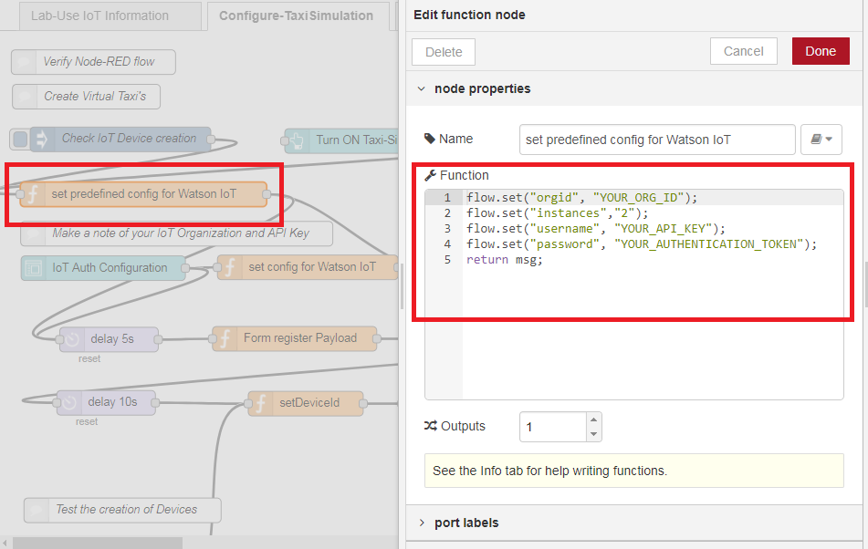

6. The **IBM IoT** node in the tab **Configure-TaxiSimulation** might cause an error. If so, insert **"*"** into *Device Id* property.


7. Press **Deploy** in the right upper corner of the Node-RED Editor page.

---
## 2.3 Configure the ObjectStorage Nodes inside the Node-RED "Configure-Blob for ObjectStorage" Tab and "Taxi-Simulation" Tab <a name="part2-3"></a>

You have to configure the credentials of the ObjectStorage usage inside Node-RED

1. Open the ObjectStorage node
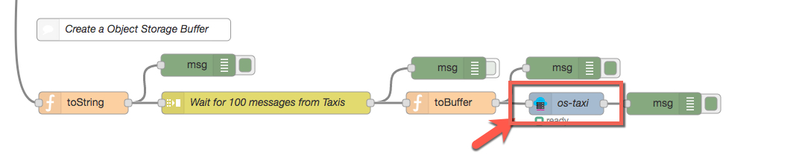

2. Open the ObjectStorage Service in a other tab and create one service credential and name it **Taxi-Simulator-Credentials**.
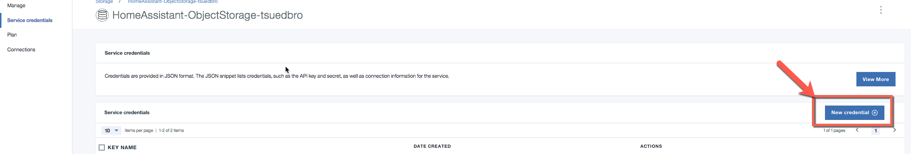

3. Open the credentials with **view credentials**.

4. Go back to your Node-RED Editor page and configure the credentials.
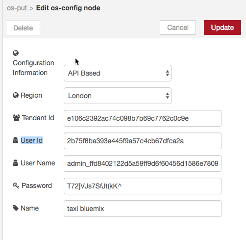

| ObjectStorage     | Node-RED Node     |
| :------------- | :------------- |
| projectId       | Tendant Id     |
| User ID       | userId    |
| User Name      | username   |
| Password      | password   |


---
## 2.4 Configure the MessageHub Node inside the Node-RED "Configure-Blob for ObjectStorage" Tab <a name="part2-4"></a>

In this tab you can create a sample data record, which will be stored in the ObjectStorage database.
We need to insert the credentials into the node configuration.

1. Open the "MessageHub" node
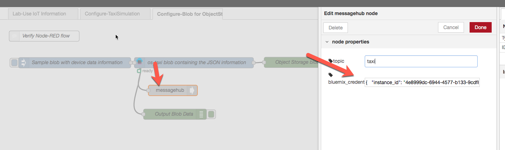

2. Open the MessageHub Service, create one service credential (1) and copy the credential into the clipboard (4).
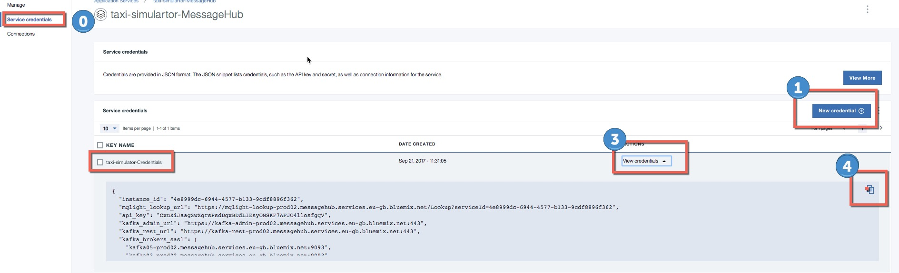

3. Copy the credentials into the open MessageHub node and press **Done**.

4. Press **Deploy** in the right upper corner of the Node-RED Editor page.

---
# 3. Use the Watson IoT input in Node-RED <a name="part3"></a>

**Create your own Node-RED flow**
* Use Watson IoT as input in your flow
* Use the Node-RED for implementing some logic and UI

0. You will start with this flow                                           
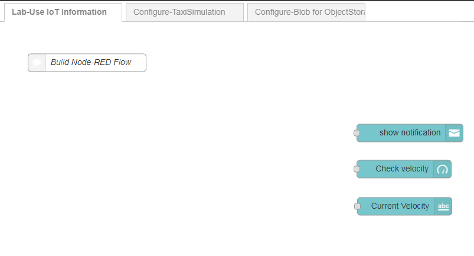

1. Create IoT input node

2. Configure IoT input node.                                             
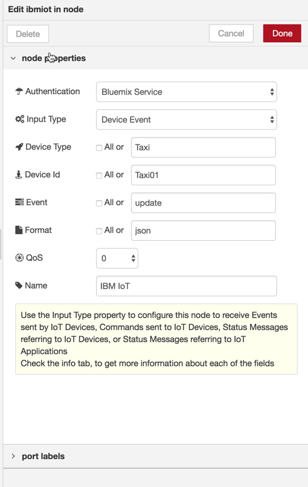

3. Add debug node and make a connection to the IoT input node

4. Add a switch node

5. In the switch node, insert the string **payload.d.velocity** into "property" and add rules for >25 and <25.              
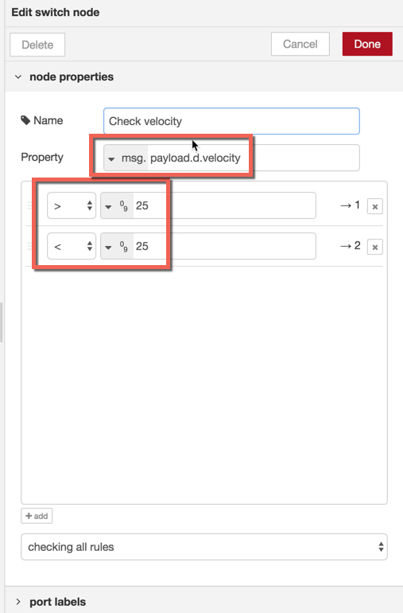

6. Create a new debug node and connect each output of the switch node.              
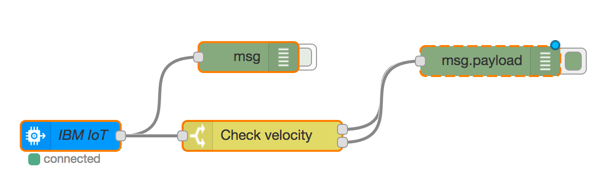

7. Create a new function node to build a text message in case of danger.        
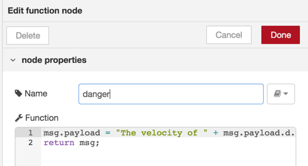
```
  // Danger
  msg.payload = "The velocity of " + msg.payload.d.velocity + " of the Taxi is to high!";
  return msg;
```

8. Create a two additional function nodes; one to build a text message in case of safe status and one to forward all data, and insert following code.          
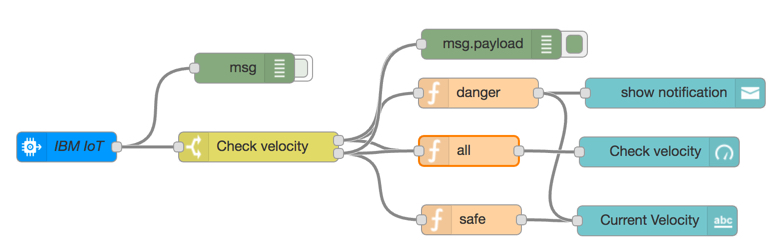
```
  // Safe
  msg.payload = "The velocity is " + msg.payload.d.velocity + ".";
  return msg;
```
```
  // All
  msg.payload = msg.payload.d.velocity;
  return msg;
```
9. Press **Deploy** in the right upper corner of the Node-RED Editor page.

---
# 4. Use the Web UI for Simulation <a name="part4"></a>
---

1. Copy the URL of your Node-RED application and add **/ui** at the end, e.g.
    ```
    https://taxi-simulartor-tsuedbro.eu-gb.mybluemix.net/ui/
    ```

    There is a menu icon in the upper left corner of the UI, please use it for navigation.

2. Under **"Taxi-Sim IoT Config"**, you can insert the API Key and Organization ID of the Watson IoT Service as well as the number of taxis you wish to simulate. Then click *"submit"* to start the simulation.

3. Under **"Taxi-Sim Status"**, you can see the status of your current simulation. There are three graphs showing the velocity over time for taxis 1 and 2 and for all taxis combined.

    To stop the simulation, press **"Turn off Taxi-Simulation"**. To start a simulation of 2 taxis, press **"Turn on Taxi Simulation (2 Taxis)"**

    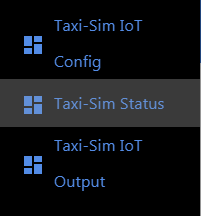

4. Under **"Taxi-Sim IoT Output"**, you can see the result of the node-red flow you added into the *"Lab-Use IoT Information"* Tab in Step 3. The velocity of *Taxi01* is displayed and there are alerts for when the velocity is too high.
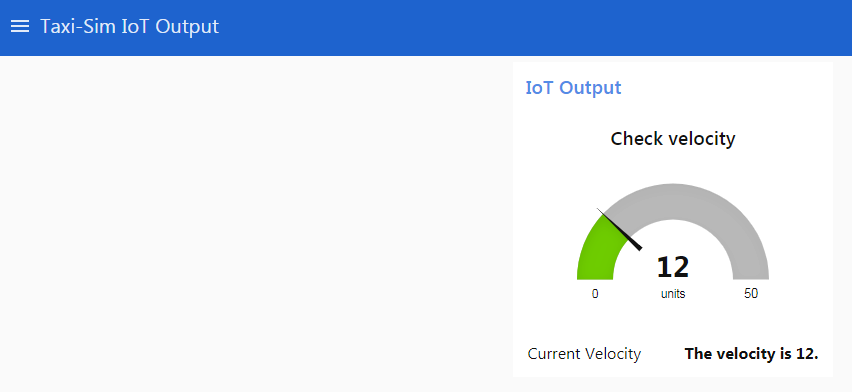

---
# 5. Analyzing the IoT data with Data Science Experience <a name="part5"></a>
---

1. Select the *Data Science Experience* Service from the Catalog.
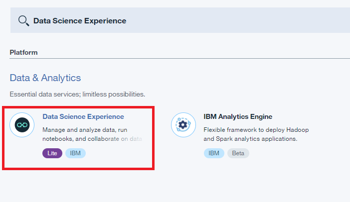

2. Name the service **taxi-simulator-Data Science Experience** or choose another name if you like.
Click *create*.


3. Open the **Data Science Experience** by pressing *Get Started*.

4. When asked to select *Organization* and *Space*, confirm the defaults and press *continue*.

5. Create a new project by clicking *Create new > Project* in the upper right corner.

    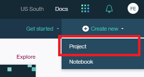

6. Give your new project a name, for example **"taxi-lab"**. Leave the defaults for the other configurations.

    The chosen Spark Service is the default Spark service that was configured when you set up your DSX account.

    The target object storage instance is your *taxi-simulator-ObjectStorage*.

    Press **create**.

    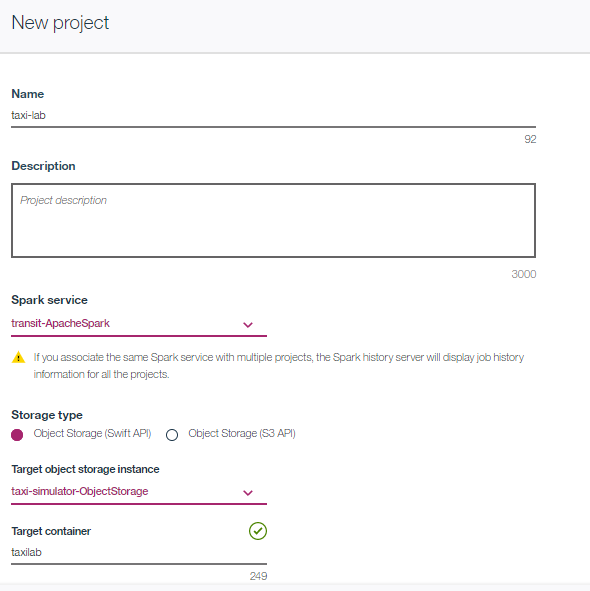

7. In your new project, select **add notebooks**. Choose **"From File"**, name the notebook *"Taxi"* (or anything else) and select the file **[python-notebook/Taxi.ipynb](python-notebook/Taxi.ipynb)** from this repository. Then press **Create Notebook**.

    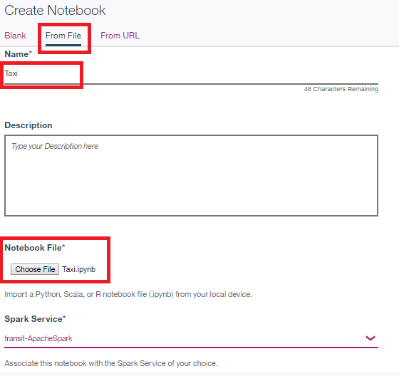

8. Follow the instructions given in the notebook.
